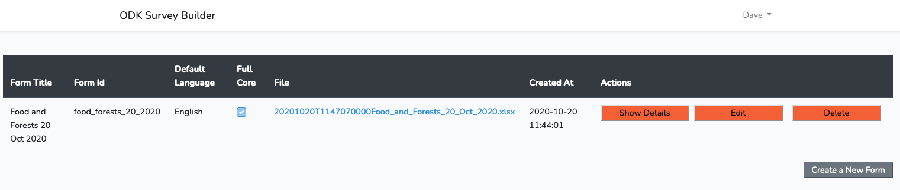
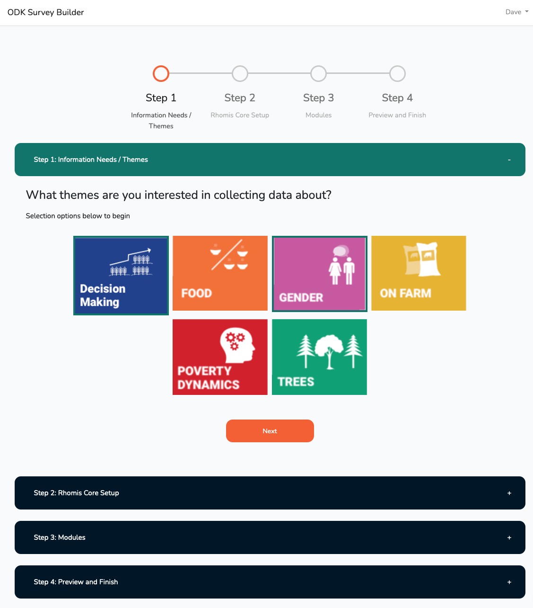
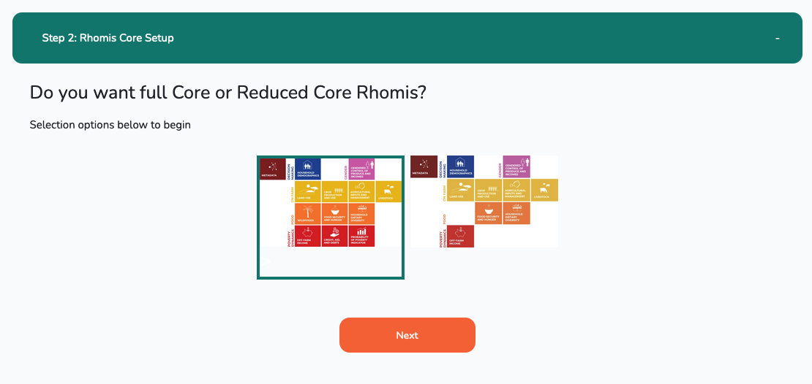
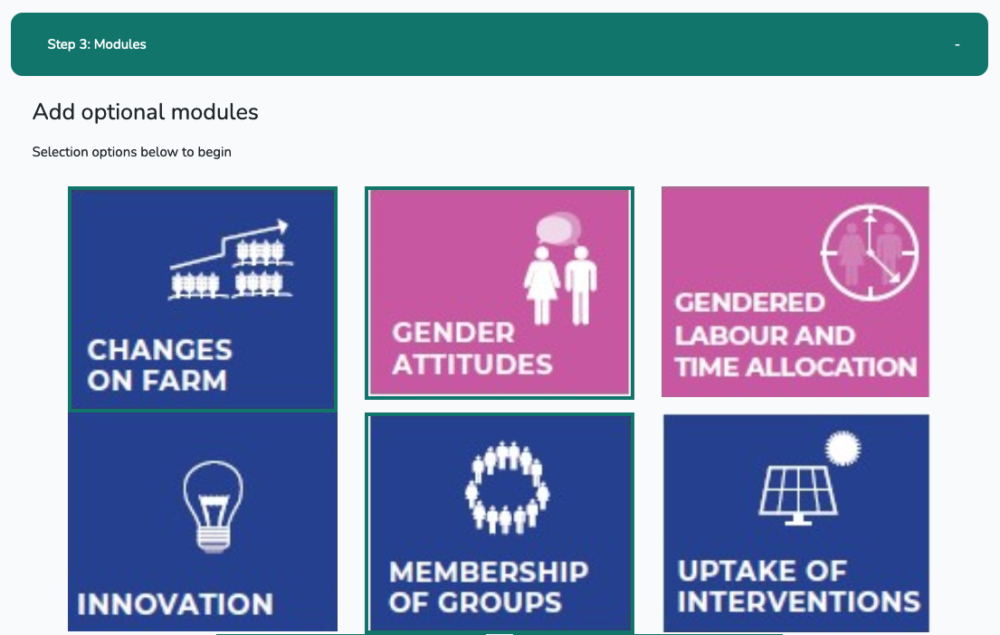
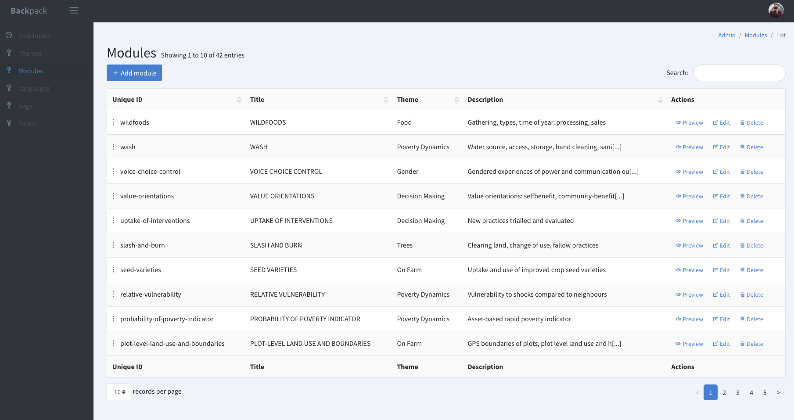

## ODK Survey Builder
> A tech-demo / proof of concept of a no-coding-needed way for users to build XLSforms from individual form modules.

This example is written in collaboration with [Rhomis](https://www.rhomis.org/).

#### Disclaimer
This is a proof-of-concept, and not a finished product. It certainly shouldn't be used in a production environment!

## Features
The main function of the tool is to allow users to generate XLSForm files based on a library of pre-written modules. These modules are the Rhomis survey modules, written in XLSform format.

### Front-end
Users log in through a standard Laravel Auth system. The dashbaord is a basic list of the forms they have created:

Form creation is done through a VueJS front-end, where users are guided through the process:
  1. Select the themes of interest
     
  2. Some core Rhomis process questions (e.g. Do you want the 'full core' RHoMIS survey, or 'reduced core'?)
    
  3. Select the optional modules, filtered by the chosen themes.
   

     1. These are taken from the optional modules, listed here: https://www.rhomis.org/design.html
  4. Preview and finish: Take a moment to reflect, add a form title, ID and default language, and click finish.

The form definition is saved to the database, and you get the option to download it as an XLSform file.

### Generate XLS Form Files
The individual modules are stored as seperate XLS files. When you ask for a form download, these files are knitted together using `scripts/merge_odk_form.py`

### Back-end / Manage options:
The tool is flexible - administrators can change the list of themes and modules in an admin panel, written using [Laravel Backpack](https://backpackforlaravel.com/).

This allows the XLS file definitions to be updated and new modules added over time. 0-1-0

## Things To Do for a 'real' version
Notes for the future...

**XLSForm Stuff**
- XLSFile module uploads currently have no validation to ensure they are valid XLSforms
- Just gluing module files together doesn't allow for any cross-interaction between modules, which is very limiting.
- Adding form settings (title, id, default language, available languages) is currently just a placeholder. Needs a full rework.
- The forms generated now will not be field-ready. Researchers would need to customise:
  - Available options in select questions (e.g. adding context-specific crops)
  - Farmer identification at the start. Adding in their own 'select location' / 'select or add farmer' pieces.
  - Keeping the only the languages they need (currently, the modules come with all languages they have been translated into...)
  - Probably other things.
- Doing those customisations within the tool requires a more technically demanding approach compared to just gluing XLS files together.

**Web Tool Stuff**

- Right now, each user has a set of forms. For a production environment, it's more likely we'll want teams who share a set of forms. (E.g. Soils Platform)
- Forms could be automatically deployed to ODK Central / Kobo / Aggregate through API calls. (E.g. Soils Platform...)
- User auth could be done in many different ways - Laravel Socialite to allow for Azure/Google/Github etc login. Token auth via some other 3rd party Rhomis-2 system.

**Rhomis Stuff**

- Ideally, the front-end would include lots of useful information taken from the existing guides to help the researcher make informed decisions at each step of the process. The tool couldn't replace proper support from the RHoMIS team, but could be a big improvement for ['DIY'](https://www.rhomis.org/diy.html) users.
- Forms created by users should have definitions stored in such a way that it's easy to pass onto other Rhomis systems, e.g. so analysis / querying can identify the correct scripts to use when getting data collected using the form.
